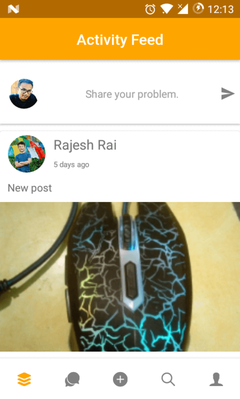

# QuestionAnswer App

College project on mobile Application.

## User Flow Screens

   

## Packages:

1. <a href="https://www.npmjs.com/package/react-navigation" target="_blank">react-navigation</a>
2. <a href="https://www.npmjs.com/package/react-native-fast-image" target="_blank">react-native-fast-image</a>
3. <a href="https://www.npmjs.com/package/react-native-firebase" target="_blank">react-native-firebase</a>
4. <a href="https://www.npmjs.com/package/react-native-gifted-chat" target="_blank">react-native-gifted-chat</a>
5. <a href="https://www.npmjs.com/package/react-moment" target="_blank">react-moment</a>
6. <a href="https://www.npmjs.com/package/react-native-image-picker" target="_blank">react-native-image-picker</a>
7. <a href="https://www.npmjs.com/package/react-native-paper" target="_blank">react-native-paper</a>
8. <a href="https://www.npmjs.com/package/react-native-user-avatar" target="_blank">react-native-user-avatar</a>
9. <a href="https://www.npmjs.com/package/react-native-vector-icons" target="_blank">react-native-vector-icons</a>
